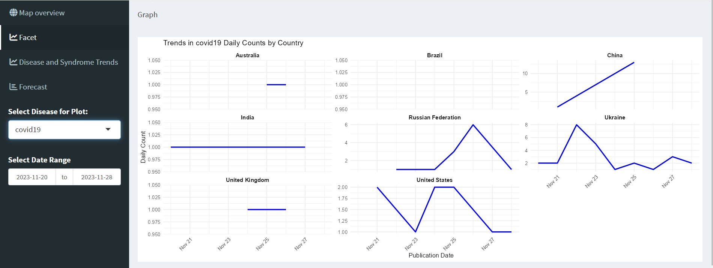

# HDS Datathon 2024 

Repo contains a code from our submission for Health Data Science Datathone 2024.
We were provided with a dataset containing news reports on infectious diseases across the globe. 
The main goal was to create a dashboard to plot the new reports and detect an outbreak before  its official declaration. 

The repo contains two files - a data pipeline, where we check data for sanity and a Shiny dashboard. 

Process looks like:
1) Plot the new cases

2) If we identify that reports on some diseases are rising, we plot the dynamics of reports across countries.

3) If we identify a country with an increasing number of reports, we try to find a preceding rise in reports on corresponding syndromes.
For example, here we can see a spike in the reports of unknown pneumonia cases in China in November 2023 before the COVID outbreak was identified.

