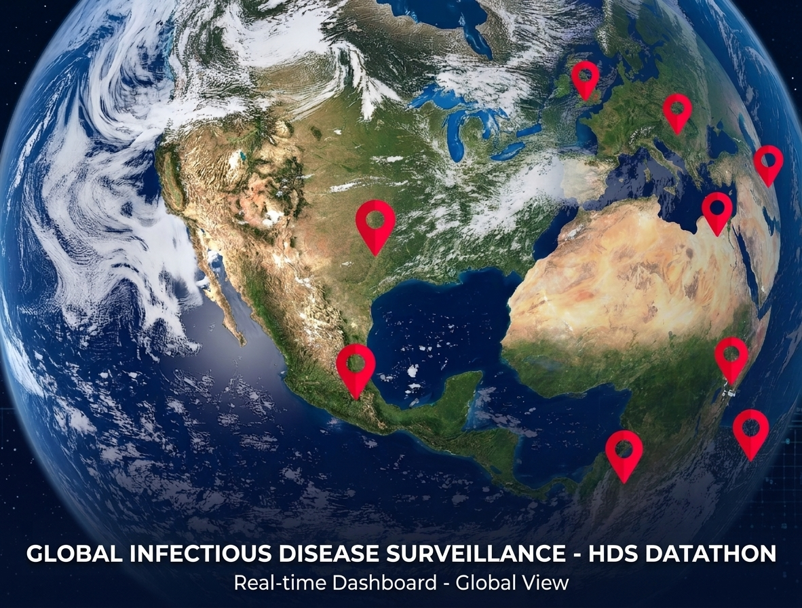
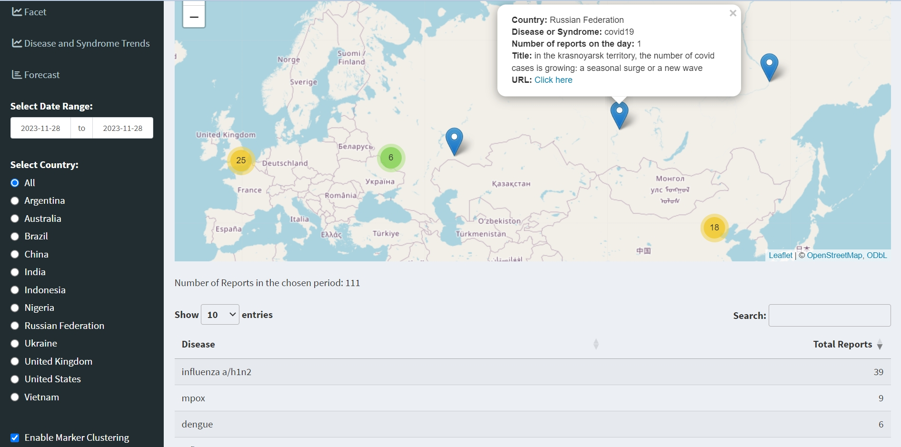
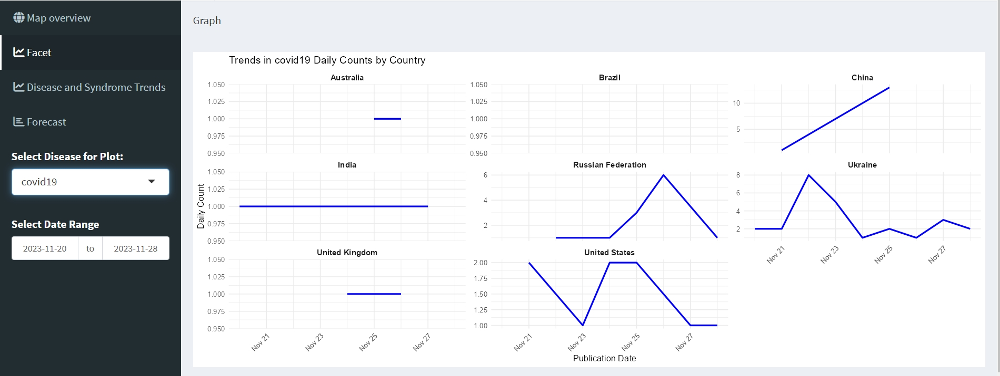
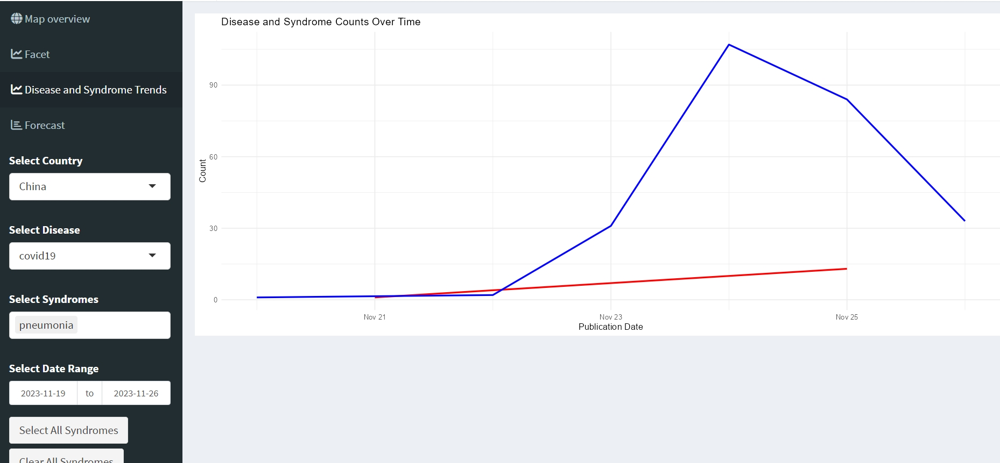

# HDS Datathon 2024



This repository contains an R Shiny dashboard developed for the Health Data Science Datathon 2024.

The project uses real EPIWATCH data to explore global infectious disease reporting patterns. EPIWATCH is an AI-based system that uses open-source data to generate automated early warnings of epidemics worldwide. It provides near real-time monitoring for infectious diseases and syndromes by scanning curated and non-curated online news sources, including the WHO, CDC, and Google News.

EPIWATCH: https://ui.epiwatch.app/

## Project Goal

The goal of this project is to help monitor infectious disease reports across countries and identify possible early outbreak signals before official declarations.

The dashboard supports:

1. Mapping disease and syndrome reports by country and date.
2. Exploring trends in disease reports over time.
3. Comparing country-level report patterns.
4. Forecasting short-term disease report trends.

This project demonstrates data wrangling in R through cleaning, standardising, validating, and reshaping real-world infectious disease surveillance data. It also applies quantitative analytics techniques, including time-based aggregation, country-level trend analysis, rolling averages, and short-term forecasting to support early outbreak signal detection.

## Repository Structure

```text
.
|-- app.R                 # Main Shiny dashboard
|-- 01_prepare_data.R     # Data cleaning and preparation pipeline
|-- run_app.R             # Helper script to launch the dashboard locally
|-- packages.txt          # Package list used by the project
|-- renv.lock             # Locked R package versions
|-- data/                 # Local data files, not committed
|-- images/               # README screenshots
`-- renv/                 # renv project environment files
```

## Reproducibility

This project uses `renv` to control R package versions.

After cloning the repository, restore the package environment with:

```r
renv::restore()
```

To update the lockfile after changing packages:

```r
renv::snapshot()
```

## Running the Project

First, prepare the cleaned dataset:

```r
source("01_prepare_data.R")
```

Then run the dashboard:

```r
shiny::runApp("app.R")
```

Alternatively, from PowerShell:

```powershell
Rscript.exe run_app.R
```

## Dashboard Workflow

1. Plot recent infectious disease reports on a global map.



2. If reports for a disease are increasing, inspect trends across countries.



3. If a country shows rising disease reports, compare them with related syndrome reports that may have appeared earlier.

For example, the dashboard can show a rise in reports of unknown pneumonia cases before COVID-19 was formally identified.


